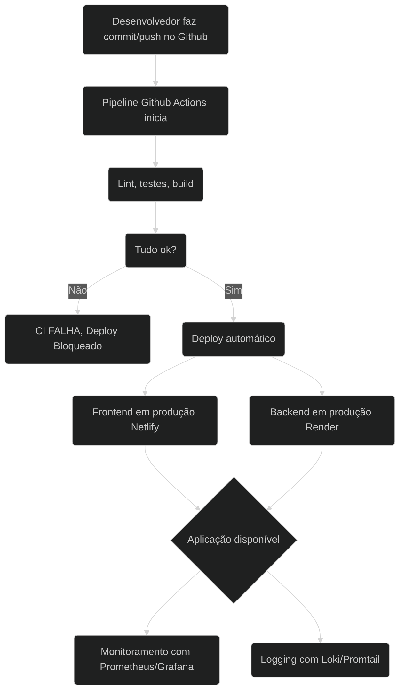

# Kanban DevOps PUCRS

> 🚀 **Projeto rodando online:**  
> 👉 **Frontend:** [https://devops-pucrs.netlify.app/](https://devops-pucrs.netlify.app/)  
> 👉 **Backend API:** [https://devops-pucrs.onrender.com/](https://devops-pucrs.onrender.com/api/)

## Descrição

Sistema Kanban full stack (React + Express + PostgreSQL) desenvolvido como projeto prático da disciplina de DevOps. O projeto utiliza integração contínua, entrega contínua e infraestrutura como código com Docker e GitHub Actions.

---

## Como rodar localmente

### Pré-requisitos

- [Node.js 18+](https://nodejs.org/)
- [Docker](https://www.docker.com/) e [Docker Compose](https://docs.docker.com/compose/)
- [Git](https://git-scm.com/)

### Passo a passo

1. **Clone o repositório**

    ```bash
    git clone https://github.com/prst97/devops.git
    cd devops
    ```

2. **Rode o projeto com Docker Compose**

    Este comando sobe o backend, frontend e banco de dados PostgreSQL em containers:

    ```bash
    docker compose up --build
    ```

    - O **frontend** ficará disponível em: [http://localhost:8080](http://localhost:8080)
    - O **backend** ficará disponível em: [http://localhost:3000](http://localhost:3000)
    - O banco de dados estará rodando em: `localhost:5432` (usuário/senha: `kanban_user`/`kanban_pass`)

3. **Parar containers**

    ```bash
    docker compose down
    ```

---

## Fluxograma do Pipeline DevOps


